<!-- translate3d(6px, 115px, 0px) scale3d(6.4,6.4,6.4); -->

When parsing, we can take advantage of data-level parallelism by operating on more than one byte at a time.
Modern CPU architectures provide us with [SIMD (single-instruction, multiple-data)](https://en.wikipedia.org/wiki/Single_instruction,_multiple_data) instructions which allow us to do some operation on all bytes in a vector simultaneously.
On the latest and greatest x86-64 hardware (with [AVX-512](https://en.wikipedia.org/wiki/AVX-512)), we have hardware support for 64-byte vectors.
This is convenient because we often want to do a [movemask](#movemask) operation which reduces the 64-byte vector into a 64-bit bitstring. Each bit in this "mask" corresponds to a byte in the vector, and can tell us some piece of information like "is it a whitespace?"


Because modern hardware also has nice bitstring-query operations, we can efficiently do, e.g., a [count-trailing-zeroes](https://en.wikipedia.org/wiki/Find_first_set) operation in 1 or 2 cycles to answer questions like "how many non-whitespace characters are there at the start of the vector?"

## Enter ARM Neon

On CPU's sporting the ARM Neon instruction set, like the popular Apple M-series chips, we do not have direct hardware support for 64-byte vectors.
Instead, we have to use 4 vectors of 16 bytes each to emulate 64-byte width.

This leaves us with a choice. We could load in 4 vectors in normal order, like so: (in [Zig](https://ziglang.org/), we can load in 64 bytes and let the compiler load in 4 vectors for us)


```zig
export fn load64Bytes(ptr: [*]u8) @Vector(64, u8) {
    return ptr[0..64].*;
}
```

Aarch64 Assembly emit:

```asm
ldp     q0, q1, [x0]; loads two vectors from pointer `x0`
ldp     q2, q3, [x0, #32]; loads two vectors from `x0+32`
```

Or in interleaved order, like so:

```zig
export fn load64BytesInterleaved(ptr: [*]u8) @Vector(64, u8) {
    return @bitCast(std.simd.deinterlace(4, ptr[0..64].*));
}
```

Aarch64 Assembly emit (we have an instruction for that!):

```asm
ld4     { v0.16b, v1.16b, v2.16b, v3.16b }, [x0]
```

However, interleaved order, hence the name, does not load data in normal order. It loads every 4th byte, with the first vector starting at byte 0, the second vector starting at byte 1, and so on:


This strategy is nice for when you have an array of 4 byte structs, where each byte is a separate field.

```zig
const rgba = struct { r: u8, g: u8, b: u8, a: u8 };
```

E.g. if you have an array of `rgba`s, `ld4` will return your `r`, `g`, `b`, and `a` values in separate vectors.

However, even when reordering is not what we're going for, we can still see efficiency gains by using this facility when [movemasking](#movemask) or when doing [vector element shifts](#elementwise-shifts).


## Movemask

If you want to produce a 64-bit bitstring that tells you where the space characters are in a 64-byte chunk, you might try the following:

```zig
export fn checkWhitespace(ptr: [*]u8) u64 {
    return @bitCast(
		@as(@Vector(64, u8), ptr[0..64].*) == @as(@Vector(64, u8), @splat(' '))
	);
}
```

At the time of writing, LLVM will give you this emit: ([Check what it is today](https://zig.godbolt.org/z/nP44MrMWx))

```asm
.LCPI0_0:
    .byte   1
    .byte   2
    .byte   4
    .byte   8
    .byte   16
    .byte   32
    .byte   64
    .byte   128
    .byte   1
    .byte   2
    .byte   4
    .byte   8
    .byte   16
    .byte   32
    .byte   64
    .byte   128
checkWhitespace:
    ldp     q0, q1, [x0]
    ldp     q2, q3, [x0, #32]
    movi    v4.16b, #32
    cmeq    v3.16b, v3.16b, v4.16b
    adrp    x8, .LCPI0_0
    ldr     q5, [x8, :lo12:.LCPI0_0]
    and     v3.16b, v3.16b, v5.16b
    ext     v6.16b, v3.16b, v3.16b, #8
    zip1    v3.16b, v3.16b, v6.16b
    addv    h3, v3.8h
    fmov    w8, s3
    cmeq    v2.16b, v2.16b, v4.16b
    and     v2.16b, v2.16b, v5.16b
    ext     v3.16b, v2.16b, v2.16b, #8
    zip1    v2.16b, v2.16b, v3.16b
    addv    h2, v2.8h
    fmov    w9, s2
    bfi     w9, w8, #16, #16
    cmeq    v1.16b, v1.16b, v4.16b
    and     v1.16b, v1.16b, v5.16b
    ext     v2.16b, v1.16b, v1.16b, #8
    zip1    v1.16b, v1.16b, v2.16b
    addv    h1, v1.8h
    fmov    w8, s1
    cmeq    v0.16b, v0.16b, v4.16b
    and     v0.16b, v0.16b, v5.16b
    ext     v1.16b, v0.16b, v0.16b, #8
    zip1    v0.16b, v0.16b, v1.16b
    addv    h0, v0.8h
    fmov    w10, s0
    bfi     w10, w8, #16, #16
    orr     x0, x10, x9, lsl #32
```

Unfortunately, LLVM, has not yet seen the light-- of interleaved vectors. Here is the x86-64 emit for Zen 4, for reference:

```asm
.LCPI0_0:
    .zero   64,32
checkWhitespace:
    vmovdqu64       zmm0, zmmword ptr [rdi]
    vpcmpeqb        k0, zmm0, zmmword ptr [rip + .LCPI0_0]
    kmovq   rax, k0
    vzeroupper
```

This paints Arm/Aarch64 in an unnecessarily bad light. With interleaved vectors, and telling the compiler exactly what we want to do, we can do a lot better.

```zig
export fn checkWhitespace(ptr: [*]u8) u64 {
    const vec: @Vector(64, u8) = @bitCast(std.simd.deinterlace(4, ptr[0..64].*));
    const spaces = @select(u8, vec == @as(@Vector(64, u8), @splat(' ')),
        @as(@Vector(64, u8), @splat(0xFF)),
        @as(@Vector(64, u8), @splat(0)));
    return vmovmaskq_u8(spaces);
}

fn vmovmaskq_u8(vec: @Vector(64, u8)) u64 {
    const chunks: [4]@Vector(16, u8) = @bitCast(vec);
    const t0 = vsriq_n_u8(chunks[1], chunks[0], 1);
    const t1 = vsriq_n_u8(chunks[3], chunks[2], 1);
    const t2 = vsriq_n_u8(t1, t0, 2);
    const t3 = vsriq_n_u8(t2, t2, 4);
    const t4 = vshrn_n_u16(@bitCast(t3), 4);
    return @bitCast(t4);
}
```

This gives us the following assembly ([See full Zig code and assembly here](https://zig.godbolt.org/z/76zEMee5K)):

```asm
checkWhitespace:
    movi    v0.16b, #32
    ld4     { v1.16b, v2.16b, v3.16b, v4.16b }, [x0]
    cmeq    v5.16b, v3.16b, v0.16b
    cmeq    v6.16b, v4.16b, v0.16b
    cmeq    v7.16b, v1.16b, v0.16b
    cmeq    v0.16b, v2.16b, v0.16b
    sri     v0.16b, v7.16b, #1
    sri     v6.16b, v5.16b, #1
    sri     v6.16b, v0.16b, #2
    sri     v6.16b, v6.16b, #4
    shrn    v0.8b, v6.8h, #4
    fmov    x0, d0
```

This is a lot cleaner! I show and explain how this routine works [here](https://www.youtube.com/live/FDiUKafPs0U?t=2245).

###### Note: if you check LLVM-mca, you will find that this is expected to run slower than the previous version [if you only care to do a single movemask](https://zig.godbolt.org/z/K9nYn1e46). However, if you want to do several movemasks simultaneously, [this version will be faster](https://zig.godbolt.org/z/69qYnzjo9). LLVM's cost model is also conservative; the `shrn` instruction has 3 cycles of latency on Apple M3's performance core, but 4 cycles of latency on their efficiency core. LLVM treats it as a 4-cycle operation.


## Mask-To-Vector

Sometimes, we want to go the other way. This may be because we did a movemask, then did some bit manipulation on the mask, and now we want to turn our mask back into a vector. Here is the routine for normal vectors on ARM64:

```zig
export fn unmovemask64(x: u64) @Vector(64, u8) {
    const bit_positions = @as(@Vector(64, u8), @splat(1)) << @truncate(std.simd.iota(u8, 64));
    const v0 = std.simd.join(@as(@Vector(8, u8), @splat(0)), @as(@Vector(8, u8), @splat(1)));
    const v1 = std.simd.join(@as(@Vector(8, u8), @splat(2)), @as(@Vector(8, u8), @splat(3)));
    const v2 = std.simd.join(@as(@Vector(8, u8), @splat(4)), @as(@Vector(8, u8), @splat(5)));
    const v3 = std.simd.join(@as(@Vector(8, u8), @splat(6)), @as(@Vector(8, u8), @splat(7)));

    const v = std.simd.join(@as(@Vector(8, u8), @bitCast(x)), @as(@Vector(8, u8), @splat(undefined)));

    const final: @Vector(64, u8) = @bitCast([4]@Vector(16, u8){ tbl(v, v0), tbl(v, v1), tbl(v, v2), tbl(v, v3) });

    return @select(u8, (final & bit_positions) == bit_positions,
        @as(@Vector(64, u8), @splat(0xFF)),
        @as(@Vector(64, u8), @splat(0)),
    );
}

fn tbl(table: @Vector(16, u8), indices: anytype) @TypeOf(indices) {
    switch (@TypeOf(indices)) {
        @Vector(8, u8), @Vector(16, u8) => {},
        else => @compileError("[tbl] Invalid type for indices"),
    }
    return struct {
        extern fn @"llvm.aarch64.neon.tbl1"(@TypeOf(table), @TypeOf(indices)) @TypeOf(indices);
    }.@"llvm.aarch64.neon.tbl1"(table, indices);
}
```

And the corresponding assembly: (I reordered the instructions and removed C ABI stuff)

```asm
.LCPI1_0:
        .byte   0
        .byte   0
        .byte   0
        .byte   0
        .byte   0
        .byte   0
        .byte   0
        .byte   0
        .byte   1
        .byte   1
        .byte   1
        .byte   1
        .byte   1
        .byte   1
        .byte   1
        .byte   1
.LCPI1_1:
        .byte   2
        .byte   2
        .byte   2
        .byte   2
        .byte   2
        .byte   2
        .byte   2
        .byte   2
        .byte   3
        .byte   3
        .byte   3
        .byte   3
        .byte   3
        .byte   3
        .byte   3
        .byte   3
.LCPI1_2:
        .byte   4
        .byte   4
        .byte   4
        .byte   4
        .byte   4
        .byte   4
        .byte   4
        .byte   4
        .byte   5
        .byte   5
        .byte   5
        .byte   5
        .byte   5
        .byte   5
        .byte   5
        .byte   5
.LCPI1_3:
        .byte   6
        .byte   6
        .byte   6
        .byte   6
        .byte   6
        .byte   6
        .byte   6
        .byte   6
        .byte   7
        .byte   7
        .byte   7
        .byte   7
        .byte   7
        .byte   7
        .byte   7
        .byte   7
.LCPI1_4:
        .byte   1
        .byte   2
        .byte   4
        .byte   8
        .byte   16
        .byte   32
        .byte   64
        .byte   128
        .byte   1
        .byte   2
        .byte   4
        .byte   8
        .byte   16
        .byte   32
        .byte   64
        .byte   128
unmovemask64:
        adrp    x9, .LCPI1_0; load the 5 vectors above into registers
        ldr     q1, [x9, :lo12:.LCPI1_0]
        adrp    x9, .LCPI1_1
        ldr     q2, [x9, :lo12:.LCPI1_1]
        adrp    x9, .LCPI1_2
        ldr     q3, [x9, :lo12:.LCPI1_2]
        adrp    x9, .LCPI1_3
        ldr     q4, [x9, :lo12:.LCPI1_3]
        adrp    x9, .LCPI1_4
        ldr     q5, [x9, :lo12:.LCPI1_4]
        fmov    d0, x0; move data from a scalar register to a vector register
        tbl     v1.16b, { v0.16b }, v1.16b; broadcast byte 0 to bytes 0-7, byte 1 to bytes 8-15
        tbl     v2.16b, { v0.16b }, v2.16b; broadcast byte 2 to bytes 0-7, byte 3 to bytes 8-15
        tbl     v3.16b, { v0.16b }, v3.16b; broadcast byte 4 to bytes 0-7, byte 5 to bytes 8-15
        tbl     v4.16b, { v0.16b }, v4.16b; broadcast byte 6 to bytes 0-7, byte 7 to bytes 8-15
        cmtst   v1.16b, v1.16b, v5.16b; turn each unique bit position into a byte of all 0xFF or 0
        cmtst   v2.16b, v2.16b, v5.16b; turn each unique bit position into a byte of all 0xFF or 0
        cmtst   v3.16b, v3.16b, v5.16b; turn each unique bit position into a byte of all 0xFF or 0
        cmtst   v4.16b, v4.16b, v5.16b; turn each unique bit position into a byte of all 0xFF or 0
```

In interleaved space, we can do better:

```zig
export fn unmovemask(x: u64) @Vector(64, u8) {
    const vec = @as(@Vector(8, u8), @bitCast(x));
    const interlaced_vec = std.simd.interlace(.{ vec, vec });

    return std.simd.join(
        std.simd.join(cmtst(interlaced_vec, @bitCast(@as(@Vector(8, u16), @splat(@as(u16, @bitCast([2]u8{ 1 << 0, 1 << 4 })))))),
                      cmtst(interlaced_vec, @bitCast(@as(@Vector(8, u16), @splat(@as(u16, @bitCast([2]u8{ 1 << 1, 1 << 5 }))))))),
        std.simd.join(cmtst(interlaced_vec, @bitCast(@as(@Vector(8, u16), @splat(@as(u16, @bitCast([2]u8{ 1 << 2, 1 << 6 })))))),
                      cmtst(interlaced_vec, @bitCast(@as(@Vector(8, u16), @splat(@as(u16, @bitCast([2]u8{ 1 << 3, 1 << 7 })))))))
    );
}

fn cmtst(a: anytype, comptime b: @TypeOf(a)) @TypeOf(a) {
    return @select(u8, (a & b) != @as(@TypeOf(a), @splat(0)), @as(@TypeOf(a), @splat(0xff)), @as(@TypeOf(a), @splat(0)));
}
```

In assembly: (after [llvm/llvm-project#107243](https://github.com/llvm/llvm-project/issues/107243), reordering, and removing C ABI ceremony)

```asm
unmovemask_interleaved:
        mov     w9, #0x400; load 4 constants into vectors
        dup     v0.8h, w9
        mov     w9, #0x501
        dup     v1.8h, w9
        mov     w9, #0x602
        dup     v2.8h, w9
        mov     w9, #0x703
        dup     v3.8h, w9
        fmov    d4, x0; move data from a scalar register to a vector register
        zip1    v4.16b, v4.16b, v4.16b; interleave input with itself -> 0 0 1 1 2 2 3 3 4 4 5 5 6 6 7 7 8 8
        cmtst   v0.16b, v0.16b, v4.16b; match bits positions: 0,4,0,4,0,4,0,4,0,4,0,4,0,4,0,4
        cmtst   v1.16b, v1.16b, v4.16b; match bits positions: 1,5,1,5,1,5,1,5,1,5,1,5,1,5,1,5
        cmtst   v2.16b, v2.16b, v4.16b; match bits positions: 2,6,2,6,2,6,2,6,2,6,2,6,2,6,2,6
        cmtst   v3.16b, v3.16b, v4.16b; match bits positions: 3,7,3,7,3,7,3,7,3,7,3,7,3,7,3,7
```

In this case, using interleaved vectors eliminated the memory accesses and reduced 4 `tbl` instructions to a single `zip1` instruction!

## Elementwise Shifts

Initially, I believed we could only do algorithms on interleaved vectors where order didn't change. However, while working on the UTF8 validator for my [Accelerated-Zig-Parser](https://github.com/Validark/Accelerated-Zig-Parser), I realized we can emulate element shifts in interleaved space.

Let's say we have a vector where each byte contains its own index. Next, we shift the elements right by one, shifting in `-1`. On normal vectors, this looks like so (only showing first 16 bytes of the vector due to space constraints):


This aligns the bytes such that each pair of contiguous bytes is now aligned column-wise. This allows us to validate 2-byte UTF8 codepoints efficiently. To properly validate 3 and 4 byte codepoints, we will need to do two more such shifts, shifting in `-2`, and `-3`:


In this article, I will refer to the main vectors as `prev0` (the top vector in the previous diagram), and the vectors containing the previous bytes, relative to `prev0`, as `prev1`, `prev2`, and `prev3`.

For UTF8 validation, we can match the 4th byte of a 4-byte sequence in `prev0`, the 3rd byte in `prev1`, the 2nd byte in `prev2`, and the 1st byte in `prev3` (because the byte-order increases by 1 as we move up a column).

Now, looking again at the interleaved vectors given by `ld4`, think about how we might find the relative `prev1`, `prev2`, and `prev3` of each of the following vectors (each one is a `prev0`):


Here are the `prev1` vectors relative to each of the vectors above:


Hopefully it is obvious that all we did is subtract one from each index from the perspective of byte-order. As you can see, the lower 3 vectors were already created by `ld4`! It's only the uppermost vector which needs to be computed, by shifting in `-1` to the vector that starts with `3`, `7`, `11`, `15`, etc.

That means we can get the semantics of a 64-byte shift by 1 by only shifting a single 16-byte vector!

Let's see how this extends to the `prev2` vectors:


Same deal as before, the bottom three vectors in this diagram we already had when we computed `prev1`. Again, we just need to compute the uppermost vector in this diagram by shifting `-2` into the vector that starts with `2`, `6`, `10`, `14`, etc.

We can do the same thing to produce the `prev3` vectors. The only additional computation needed is that we need to shift in `-3` to the vector that starts with `1`, `5`, `9`, `13`, etc. Once we do that, we will have the following vectors:



In the above diagram, each of the bottom 4 vectors are a `prev0` vector. The `prev1` vector, relative to each `prev0` vector, is the one above it, the `prev2` is the one 2 rows above, and the `prev3` is 3 rows above, for each `prev0` vector.

With only 3 vector shifts, and a total of 7 vectors in play, we can operate on all the shifted vectors we need for a 64-byte chunk. Compare this to needing to produce a separate `prev1`, `prev2`, and `prev3` for each 16-byte vector, which takes a total of 12 vector shifts for 64 bytes.

Using this intuition, we can write a function which emulates the semantics of a vector shift by any compile-time known amount on normally-ordered vectors, but for interleaved vectors! This removes the restriction of only using this vector interleaving trick in circumstances where order didn't change.

```zig
fn shiftInterleavedElementsRight(
    vecs: [4]@Vector(16, u8),
    comptime amount: std.simd.VectorCount(@Vector(64, u8)),
    shift_in: std.meta.Child(@Vector(64, u8))
) [4]@Vector(16, u8) {
    var new_vecs = vecs;

    if ((amount & 1) == 1) {
        const n = std.simd.shiftElementsRight(new_vecs[3], 1, shift_in);
        new_vecs[3] = new_vecs[2];
        new_vecs[2] = new_vecs[1];
        new_vecs[1] = new_vecs[0];
        new_vecs[0] = n;
    }

    if ((amount & 2) == 2) {
        const n1 = std.simd.shiftElementsRight(new_vecs[3], 1, shift_in);
        const n0 = std.simd.shiftElementsRight(new_vecs[2], 1, shift_in);
        new_vecs[3] = new_vecs[1];
        new_vecs[2] = new_vecs[0];
        new_vecs[1] = n1;
        new_vecs[0] = n0;
    }

    const leftover_amt = amount >> 2;

    if (leftover_amt > 0) {
        new_vecs = .{
            std.simd.shiftElementsRight(new_vecs[0], leftover_amt, shift_in),
            std.simd.shiftElementsRight(new_vecs[1], leftover_amt, shift_in),
            std.simd.shiftElementsRight(new_vecs[2], leftover_amt, shift_in),
            std.simd.shiftElementsRight(new_vecs[3], leftover_amt, shift_in)
        };
    }

    return new_vecs;
}
```

## Prefix sums

While interleaved vectors are a clear win for reducing the number of vector shifts required for our UTF8 use-case, even emulating a 64-byte vector shift by doing only a single 16-byte shift (!!), it doesn't always work out favorably.

The prefix-sum algorithm includes a situation with worse performance for interleaved vectors relative to normal-ordered vectors:

```zig
fn prefixSum(vec_: @Vector(64, u8)) @Vector(64, u8) {
    var vec = vec_ + std.simd.shiftElementsRight(vec_, 1, 0);
    vec += std.simd.shiftElementsRight(vec, 2, 0);
    vec += std.simd.shiftElementsRight(vec, 4, 0);
    vec += std.simd.shiftElementsRight(vec, 8, 0);
    vec += std.simd.shiftElementsRight(vec, 16, 0);
    return vec + std.simd.shiftElementsRight(vec, 32, 0);
}
```

To compute the last two lines, where we want to shift by 16 and 32 respectively, each of those will require 4 vector shifts and 4 adds to simulate over interleaved vectors. [However, with normally-ordered vectors, 0 instructions are necessary to shift by multiples of 16 (the vector length), and only 3 and 2 adds are needed respectively](https://zig.godbolt.org/z/xWEoKq5cz) (because adding a vector of all zeroes is optimized away). See [here](https://zig.godbolt.org/z/nq99edxf9) for a playground showing the prefix-sum performed in interleaved space versus normal space.

If we consider that each line of the `prefixSum` function "should" take 4 vector shift (`ext`) and 4 add instructions, the interleaved variant saves 5 vector shift instructions on the first two lines, and the normal version saves 8 vector shift instructions and 3 adds on the last two lines. That means the normal version takes 6 fewer instructions per iteration.

However, using interleaved vectors has instruction-level-parallelism advantages that almost even it out. [According to LLVM-mca](https://zig.godbolt.org/z/f45WE4eTe), the Apple M3 can do a prefix sum in interleaved space in ~14.86 cycles, whereas it can do it in normal (non-interleaved) space in ~12.87 cycles, a difference of ~1.99 cycles, despite the difference of 6 instructions.

## Conclusion

So next time you want to parse [utf8](https://github.com/simdutf/simdutf/issues/428), [JSON](https://github.com/simdjson/simdjson), or [Zig](https://github.com/Validark/Accelerated-Zig-Parser), be sure to use interleaved vectors!
