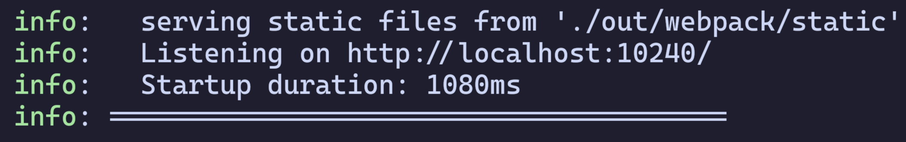
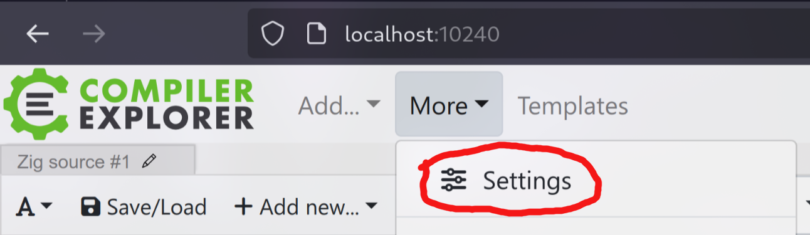
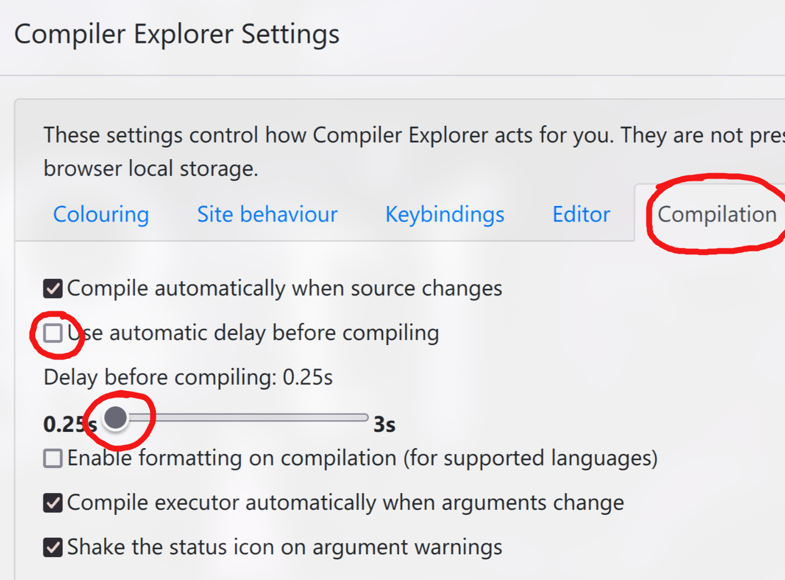
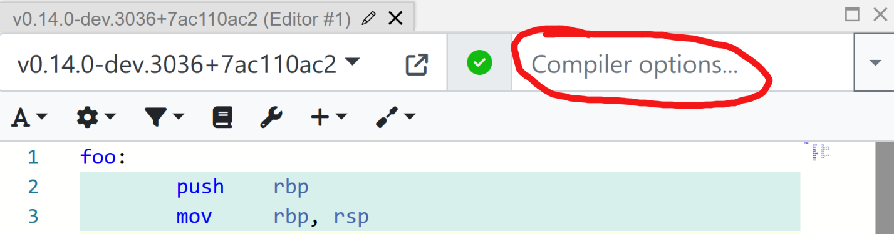
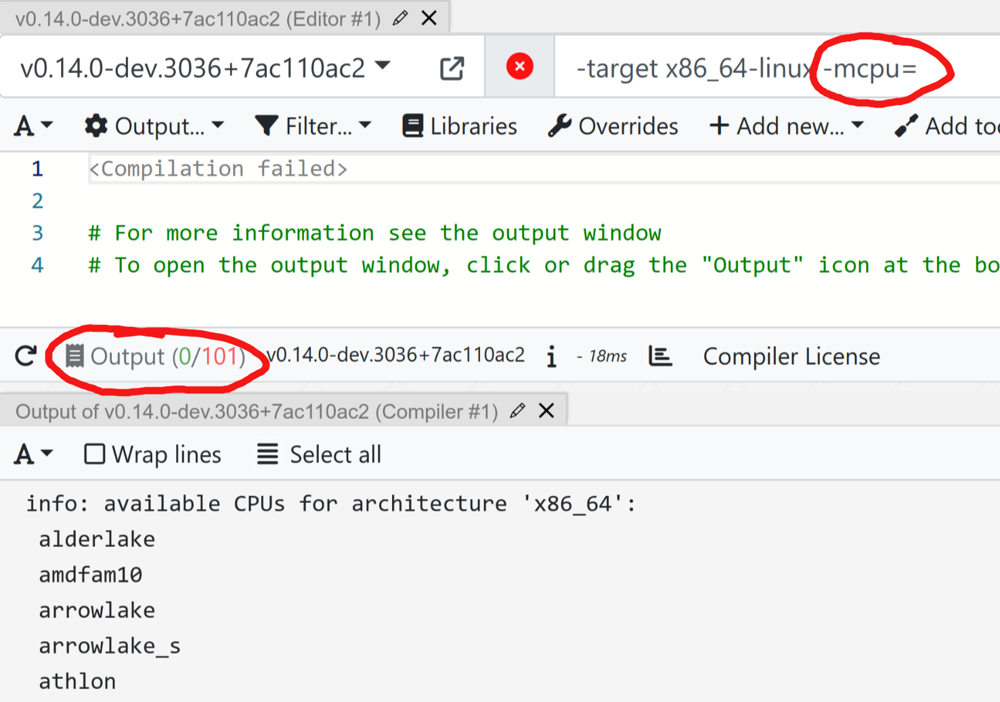

Compiler Explorer is known for its ability to automatically handle all the necessary setup to view source code side-by-side with assembly code. One simply navigates to [godbo.lt](https://godbo.lt/), and, after the download completes, everything just works.

However, often times I prefer to use a local setup because it is faster and does not require sending a request to an external server to compile my code.

This article will walk through how to set up Compiler Explorer on a local machine.

## Prerequisites

First, open a terminal with [Node.js](https://nodejs.org/en) and [Zig](https://ziglang.org/) installed. If done, skip to the [setup section of this article](#setup).

If you are unsure whether you have [Node.js](https://nodejs.org/en), you can always check by pasting the following command into your terminal and hitting enter:

```sh
node -v
```

If [Node.js](https://nodejs.org/en) exists on your system, you will see some version number like so:

```
v22.13.1
```

If you see something like "command not found", you will have to install it. You may install it via any package manager, but I prefer using [Webi](https://webinstall.dev/webi/). Simply paste this into your terminal and hit enter.

```sh
curl -sS https://webi.sh/node | sh; \
source ~/.config/envman/PATH.env
```

If you are unsure whether you have [Zig](https://ziglang.org/), you can always check by pasting the following command into your terminal and hitting enter:

```sh
zig version
```

If it says something like "command not found", you can install it via [Webi](https://webinstall.dev/webi/).

```sh
curl -sS https://webi.sh/zig | sh; \
source ~/.config/envman/PATH.env
```

[Webi](https://webinstall.dev/webi/) also conveniently comes with a little helper script that will allow you to update or switch versions via `webi node@<tag>` (you can use `@lts` for long-term support, `@beta` for pre-releases, or `@x.y.z` for a specific version).

## Setup

Next, navigate in the terminal to the folder where you want the eventual "compiler-explorer" folder to live. I usually install GitHub stuff in `Documents/github`. So I would do:

```sh
cd Documents/github
```

Next, `git clone` the Compiler Explorer and `cd` into it:

```sh
git clone https://github.com/compiler-explorer/compiler-explorer.git --depth 1
cd compiler-explorer/
```

Next, we want to download all the dependencies of `Compiler Explorer`. Luckily, they have a very easy-to-use helper:

```sh
git pull origin main
make prebuild EXTRA_ARGS='--language zig'
```

You can re-run that command any time you want to pull the latest changes from GitHub and rebuild locally.

(I use `EXTRA_ARGS='--language zig'` here because I only care about the dependencies necessary for using Godbolt with the Zig compiler.)

Next, we are going to download a little script I wrote (disclosure: AI wrote the first draft) and name it `zig.sh`. Then we give it permission to be "executable":

```sh
curl -o zig.sh https://raw.githubusercontent.com/Validark/Zig-Compiler-Explorer-Shim/refs/heads/main/zig.sh
chmod +x zig.sh
```

## Usage

Now we can start the Compiler Explorer Server by simply running:

```sh
./zig.sh
```

This script will try to automatically find all of your zig compilers that are installed in the same place as the one in your PATH and emit a `zig.local.properties` file which lists each one for Compiler Explorer. If it doesn't, feel free to [open an issue here](https://github.com/Validark/Zig-Compiler-Explorer-Shim/issues).

If everything worked properly, it should open on a local port you can open in your browser.



For me, I can access it by navigating to http://localhost:10240/

## Configuration

I recommend changing some of the default settings of Compiler Explorer. In your browser, click "More" and then "Settings".



Then navigate to the "Compilation" tab, untick "Use automatic delay before compiling", and move the slider below it all the way to 0.25s. This makes the compiler feel a lot snappier.



Now you can enjoy Compiler Explorer locally!

## Changing the Compiler Target

In the "Compiler Options" field you might want to try different targets.



The format is `-target <arch><sub>-<os>-<abi>` (ABI is optional). Examples:

```sh
-target aarch64-macos
# OR
-target x86_64-windows
# OR
-target riscv64-linux
```

You can also add an `-mcpu=` flag and if you click the "Output" button at the bottom it will show you a list of options for a given architecture.




I personally use `-target x86_64-linux -mcpu=znver5`. If you want to target an M-series MacBook, you could use `-target aarch64-macos -mcpu=apple_m3`.

My `zig.sh` script automatically sets the compiler to use `-O ReleaseFast`. You can override this in the same "Compiler Options" field if you want. You could try:

```sh
-O ReleaseSafe
# OR
-O ReleaseSmall
# OR
-O Debug
```

Note that, for some reason, source-mapping does not work with `ReleaseSmall`.

Have fun!

‒ Validark
