In my last article, [*Use interleaved vectors for parsing on ARM*](../interleaved-vectors-on-arm/), I covered the three main algorithms we need to support on interleaved vectors for high performance parsing of [utf8](https://github.com/simdutf/simdutf/issues/428), [JSON](https://github.com/simdjson/simdjson), or [Zig](https://github.com/Validark/Accelerated-Zig-Parser) for aarch64/ARM architectures. Namely, the [movemask](../interleaved-vectors-on-arm/#movemask) and [unmovemask](../interleaved-vectors-on-arm/#unmovemask) routines, as well as the [elementwise shift](../interleaved-vectors-on-arm/#elementwise-shifts) replacement, all of which are more efficient when performed on interleaved vectors (except when shifting by a multiple of 16). I also briefly explained that we can perform prefix sum operations using these elementwise shifts, but I did not explain why we might want to. The answer is vector compression.

## Vector Compression

In high performance parsers, we sometimes produce a vector bytemask and/or a bitmask which indicates certain elements we want to keep, and the rest should be thrown out. On the latest and greatest x86-64 hardware (with [AVX-512](https://en.wikipedia.org/wiki/AVX-512)), we have the `VPCOMPRESSB` instruction, which can extract just those bytes from a 64-byte vector corresponding to a bitmask we pass in.

On Arm, however, there is no `VPCOMPRESSB`, nor is there an interleaved equivalent. So, per usual, we have to roll our own.

Luckily, we reproduce the semantics of `VPCOMPRESSB` by:
1. Finding the (exclusive) prefix sum of the bytemask.
2. Adding the prefix sum to the identity counting vector.
3. Simultaneously shifting each element by their corresponding amount, calculated in step 2.

## Prefix Sum

As in the previous article, the prefix-sum of a vector can be computed like so:

```zig
fn prefixSum(vec_: @Vector(64, u8)) @Vector(64, u8) {
    var vec = vec_;
    inline for (0..6) |i| { // iterates from 0 to 5
        vec += std.simd.shiftElementsRight(vec, 1 << i, 0);
    }
    return vec;
}
```

And, as first shown in the previous article, we can abstract away the [elementwise vector shifts](../interleaved-vectors-on-arm/#elementwise-shifts) with a helper function. That way, our interleaved version looks like so:

```zig
fn prefixSum(vec_: @Vector(64, u8)) @Vector(64, u8) {
    var vec = vec_;
    inline for (0..6) |i| { // iterates from 0 to 5
        vec += shiftInterleavedElementsRight(vec, 1 << i, 0);
    }
    return vec;
}
```

It looks the same!

Since we abstracted away the interleaved shift, we can think of it as though it's just a normal-ordered vector. So here is what a prefix sum looks like for a normally-ordered vector:


As depicted above, we first shift the vector right by one, then add that to itself. Then we shift the result of that addition to the right by two, then add that to our previous result. If we continue with this pattern, every column ends up becoming the sum of all bytes that came before it.

To apply this to vector compression, start with a `-1` in each slot you intend to keep, and a `0` otherwise:



Next, shift our result to the right by 1 because we want the exclusive prefix sum (if possible, it's more efficient to do this beforehand). Then add the final result to the identity counting vector.



This resulting `travel_distances` vector contains, for the (red) elements we care about, how many slots they each need to be shifted leftwards.

## Compression via prefix-sum

Next, we shift each element left by the `travel_distances` we calculated from the `prefix_sums` vector. To accomplish this, we shift the vector by successive powers of 2, each time keeping only values whose binary representation has a 1 bit in the place value corresponding to the current power of 2, otherwise keeping the previous value. E.g., if we want to shift an element by a total of `5` slots, we will shift it during the 1-shift and 4-shift stage, because the binary representation of `5` is `0b101` (i.e. 1+4).


```zig
// Compresses the elements in `data` corresponding to non-zero bytes in the `condition` vector.
// Note this return a compressed 64-byte vector in interleaved space, meaning that if you want to write
// this out to memory, you need to use the `st4` instruction.
fn compress(data: @Vector(64, u8), prefix_sums: @Vector(64, u8)) @Vector(64, u8) {
    const indices = comptime @as(@Vector(64, u8), @bitCast(std.simd.deinterlace(4, std.simd.iota(u8, 64))));
    var travel_distances = indices +% prefix_sums;
    var compressed_data = data;

    inline for (0..6) |x| {
        const i = 1 << x;
        const shifted_travel_distances = shiftInterleavedElementsLeft(travel_distances, i, 0));
        const shifted_compressed_data = shiftInterleavedElementsLeft(compressed_data, i, 0));
        const selector = cmtst(shifted_travel_distances, @splat(i));
        travel_distances = bsl(selector, shifted_travel_distances, travel_distances);
        compressed_data = bsl(selector, shifted_compressed_data, compressed_data);
    }

    return compressed_data;
}

fn cmtst(a: anytype, comptime b: @TypeOf(a)) @TypeOf(a) {
    return @select(u8, (a & b) != @as(@TypeOf(a), @splat(0)), @as(@TypeOf(a), @splat(0xff)), @as(@TypeOf(a), @splat(0)));
}

fn bsl(selector: anytype, a: @TypeOf(selector), b: @TypeOf(selector)) @TypeOf(selector) {
    return (a & selector) | (b & ~selector);
}
```

Unfortunately, this method requires a logarithmic number of steps, both in the prefix sum and the compression stage. It also has a strict serial dependency chain from start to finish.

We can do better by finding the prefix sum of each group of 8 or 16, and writing out to memory 8 or 4 times instead of once.

## Breaking it up



In order to prefix-sum and vector-compress groups of 8, 16 or 32, we need to be careful that our `shiftInterleavedElementsLeft` and `shiftInterleavedElementsRight` functions do not go across the boundaries we set. If we want to vector-compress groups of 8, we want our elementwise shift emulation to not add element 7 to element 8, 15 to 16, 23 to 24, etc. Luckily, we have an instruction that puts barriers between these groups. The `shl`/`shr` instructions! For groups of 8, we use 2-byte-granularity shifts, for groups of 16, we use 4, and for groups of 32 we would use 8-byte-granularity shifts.

I define a custom `shiftElementsLeft` upon which `shiftInterleavedElementsLeft` is built (see definition of `shiftInterleavedElementsRight` [here](../interleaved-vectors-on-arm/#shiftInterleavedElementsRight)), which has a comptime `boundary` parameter. When the `boundary` is smaller than a `u128`, we will use a 16, 32, or 64 bit-wise shift:

```zig
fn shiftElementsLeft(vec: @Vector(16, u8), comptime amount: std.simd.VectorCount(@Vector(64, u8)), comptime boundary: type) @Vector(16, u8) {
    return if (boundary == u128)
        std.simd.shiftElementsLeft(vec, amount, 0)
    else
        @bitCast(@as(@Vector(16 / @sizeOf(boundary), boundary), @bitCast(vec)) >> @splat(8*amount));
}
```

This allows us to get our `st4` instructions started earlier, with a lot more parallelism:

```zig
inline for (0..64 / WIDTH) |i| {
    st4(
        dest[if (i == 0) 0 else prefix_sum_of_offsets[i*(WIDTH / 8) - 1]..],
        shiftInterleavedElementsLeft(compressed_data, WIDTH*i, u128)
    );
}
```

Where `prefix_sum_of_offsets` is defined like so:

```zig
comptime var prefix_sum_multiplier = 0;
inline for (0..64 / WIDTH) |i| prefix_sum_multiplier |= 1 << i*WIDTH;
const prefix_sum_of_offsets: [8]u8 = @bitCast(
@as([2]u64, @bitCast(
    uzp2(
        neg(
            @as([4]@Vector(16, u8), @bitCast(prefix_sums))[3]
        )
    )
))[0] *% prefix_sum_multiplier);
```

This takes the bottommost prefix-sums vector, corresponding to what was originally `3, 7, 11, 15, 19`, etc, then takes the arithmetic negative of each element, then extracts the odd bytes into a `u64`, then multiplies by a constant `prefix_sum_multiplier` that has every `WIDTH` bits set to 1. E.g. when `WIDTH` is 8, it will multiply by `0x0101010101010101`, which will compute the byte-wise prefix-sum. When `WIDTH` is 16, it will multiply by `0x0001000100010001`, computing the 2-byte-wise prefix-sum. Quickly producing the `prefix_sum_of_offsets` with a multiply instead of a serial dependency chain of add instructions allows us to calculate the destination pointers in parallel.

Putting it all together: ([full code here](https://zig.godbolt.org/z/6enM4KxK6))

```zig
const WIDTH = 16; // How many elements to operate on at once

/// Compresses the elements in `data` corresponding to the `condition` vector.
/// Writes to `dest`, including a number of undefined bytes.
/// In total, this expression gives the number of bytes written past `dest`:
/// switch (WIDTH) {
///    8, 16, 32 => (64 - WIDTH) + 32,
///    64 => 64,
/// }
export fn compress(data: @Vector(64, u8), condition: @Vector(64, u8), dest: [*]u8) u8 {
    const U = std.meta.Int(.unsigned, WIDTH*2);
    const indices = comptime @as(@Vector(64, u8), @bitCast(std.simd.deinterlace(4, std.simd.iota(u8, 64) & @as(@Vector(64, u8), @splat(WIDTH - 1)))));

    var prefix_sums = @select(u8, condition != @as(@Vector(64, u8), @splat(0)),
        @as(@Vector(64, u8), @splat(255)),
        @as(@Vector(64, u8), @splat(0)),
    );

    // Next, shift elements right by 1, 2, 4, 8, 16, and 32, and accumulate at each step
    inline for (0..std.math.log2(WIDTH)) |i| {
        prefix_sums +%= shiftInterleavedElementsRight(prefix_sums, 1 << i, U);
    }

    comptime var prefix_sum_multiplier = 0;
    inline for (0..64 / WIDTH) |i| prefix_sum_multiplier |= 1 << i*WIDTH;
    const prefix_sum_of_offsets: [8]u8 = @bitCast(
    @as([2]u64, @bitCast(
        uzp2(
            neg(
                @as([4]@Vector(16, u8), @bitCast(prefix_sums))[3]
            )
        )
    ))[0] *% prefix_sum_multiplier);

    // Now take the identity indices and add it to the prefix_sums.
    // This value tells us how far each value should be left-shifted
    var travel_distances = indices +% shiftInterleavedElementsRight(prefix_sums, 1, U);
    var compressed_data = data;

    inline for (0..std.math.log2(WIDTH)) |x| {
        const i = 1 << x;
        const shifted_left = shiftInterleavedElementsLeft(travel_distances, i, U);
        const shifted_compressed_data = shiftInterleavedElementsLeft(compressed_data, i, U);
        const selector = cmtst(shifted_left, @splat(i));
        travel_distances = bsl(selector, shifted_left, travel_distances);
        compressed_data = bsl(selector, shifted_compressed_data, compressed_data);
    }

    inline for (0..64 / WIDTH) |i| {
        (if (WIDTH == 64) st4 else st4_first_32)(
            dest[if (i == 0) 0 else prefix_sum_of_offsets[i*(WIDTH / 8) - 1]..],
            shiftInterleavedElementsLeft(compressed_data, WIDTH*i, u128)
        );
    }

    return prefix_sum_of_offsets[7];
}
```

Subject to the following issues:

<div id="issue-dump" style="display: flex; flex-direction: column; align-items: center; align-self: flex-start">

</div>

<script>
    document.getElementById("issue-dump").innerHTML = [107438, 107423, 107404, 107243, 107099, 107093, 107088].map(i => `<div class="individual-issue">
<div><svg id="issue-indicator-${i}" class="issue-indicator issue-indicator-unknown" viewBox="0 0 16 16" version="1.1" width="20" height="20" aria-hidden="true"><path stroke="none" fill="#59636e" d="M8 0a8 8 0 1 1 0 16A8 8 0 0 1 8 0ZM1.5 8a6.5 6.5 0 1 0 13 0 6.5 6.5 0 0 0-13 0Zm9.78-2.22-5.5 5.5a.749.749 0 0 1-1.275-.326.749.749 0 0 1 .215-.734l5.5-5.5a.751.751 0 0 1 1.042.018.751.751 0 0 1 .018 1.042Z"></path></svg></div>

<div>

<p><a href="https://github.com/llvm/llvm-project/issues/${i}">llvm/llvm-project#${i}</a></p>

</div>
</div>`).join("\n\n");
</script>

<script is:inline>
{
    const open = '<path stroke="none" fill="#1a7f37" d="M8 9.5a1.5 1.5 0 1 0 0-3 1.5 1.5 0 0 0 0 3Z"></path><path stroke="none" fill="#1a7f37" d="M8 0a8 8 0 1 1 0 16A8 8 0 0 1 8 0ZM1.5 8a6.5 6.5 0 1 0 13 0 6.5 6.5 0 0 0-13 0Z"></path>';

    const closed_completed = '<path stroke="none" fill="#8250df" d="M11.28 6.78a.75.75 0 0 0-1.06-1.06L7.25 8.69 5.78 7.22a.75.75 0 0 0-1.06 1.06l2 2a.75.75 0 0 0 1.06 0l3.5-3.5Z"></path><path stroke="none" fill="#8250df" d="M16 8A8 8 0 1 1 0 8a8 8 0 0 1 16 0Zm-1.5 0a6.5 6.5 0 1 0-13 0 6.5 6.5 0 0 0 13 0Z"></path>';

    const closed_not_planned = '<path stroke="none" fill="#59636e" d="M8 0a8 8 0 1 1 0 16A8 8 0 0 1 8 0ZM1.5 8a6.5 6.5 0 1 0 13 0 6.5 6.5 0 0 0-13 0Zm9.78-2.22-5.5 5.5a.749.749 0 0 1-1.275-.326.749.749 0 0 1 .215-.734l5.5-5.5a.751.751 0 0 1 1.042.018.751.751 0 0 1 .018 1.042Z"></path>';
    for (const issue_id of [107438, 107423, 107404, 107243, 107099, 107093, 107088]) {
        fetch(`https://api.github.com/repos/llvm/llvm-project/issues/${issue_id}`)
            .then(e => e.json())
            .then(e => {
                const svg = e.state === "open" ? open : e.state_reason === "completed" ? closed_completed : closed_not_planned;

                for (const e of document.getElementsByClassName("issue-indicator")) {
                    if (e.id === `issue-indicator-${issue_id}`) {
                        e.classList.remove("issue-indicator-unknown");
                        e.innerHTML = svg;
                    }
                }
            })
    }
}
</script>

<style>
.issue-indicator-unknown {
    transform: "rotate(45)";
}

.individual-issue {
    display: flex; flex-direction: row; align-items: center; align-self: flex-start;
}

.individual-issue > div {
    margin-right: 0.5em;
}

.individual-issue > div + div {
    height: 2.3em;
}

.individual-issue > div + div > p {
    margin-top: 0;
    margin-bottom: 0;
    line-height: 1.5;
    white-space: nowrap;
}

p + div#issue-dump {
    margin-bottom: 0.5em;
}
</style>

## Technique II: Lookup table

Unfortunately, it seems that even with those issues fixed, it's still going to be more efficient to use a lookup table, if you can afford to consume 2KiB of your precious cache. ([Godbolt link](https://zig.godbolt.org/z/rKhEzdnPf))

```zig
export fn compress(interleaved_data: @Vector(64, u8), bitstring: u64, dest: [*]u8) void {
    comptime var lookups: [256]@Vector(8, u8) = undefined;
    comptime {
        @setEvalBranchQuota(100000);
        for (&lookups, 0..) |*slot, i| {
            var pos: u8 = 0;
            for (0..8) |j| {
                const bit: u1 = @truncate(i >> j);
                slot[pos] = j / 4 + (j & 3) * 16;
                pos += bit;
            }

            for (pos..8) |j| {
                slot[j] = 255;
            }
        }
    }

    const chunks: [4]@Vector(16, u8) = @bitCast(interleaved_data);

    const prefix_sum_of_popcounts =
        @as(u64, @bitCast(@as(@Vector(8, u8), @popCount(@as(@Vector(8, u8), @bitCast(bitstring))))))
            *% 0x0101010101010101;

    inline for (@as([8]u8, @bitCast(bitstring)), @as([8]u8, @bitCast(prefix_sum_of_popcounts)), 0..)
    |byte, pos, i| {
        dest[pos..][0..8].* = tbl4(
            chunks[0],
            chunks[1],
            chunks[2],
            chunks[3],
            lookups[byte] +| @as(@Vector(8, u8), @splat(2*i))
        );
    }
}

fn tbl4(
    table_part_1: @Vector(16, u8),
    table_part_2: @Vector(16, u8),
    table_part_3: @Vector(16, u8),
    table_part_4: @Vector(16, u8),
    indices: @Vector(8, u8)
) @TypeOf(indices) {
    return struct {
        extern fn @"llvm.aarch64.neon.tbl4"(@TypeOf(table_part_1), @TypeOf(table_part_2), @TypeOf(table_part_3), @TypeOf(table_part_4), @TypeOf(indices)) @TypeOf(indices);
    }.@"llvm.aarch64.neon.tbl4"(table_part_1, table_part_2, table_part_3, table_part_4, indices);
}
```

This technique also has to use `tbl4` because it is deinterleaving the data at the same time as compressing. In normal space, you would just use `tbl1`. But hey, as long as there is no serial dependency, you only eat the latency once.

Now go compress your interleaved vectors, you glorious vectorizers!

‒ Validark
